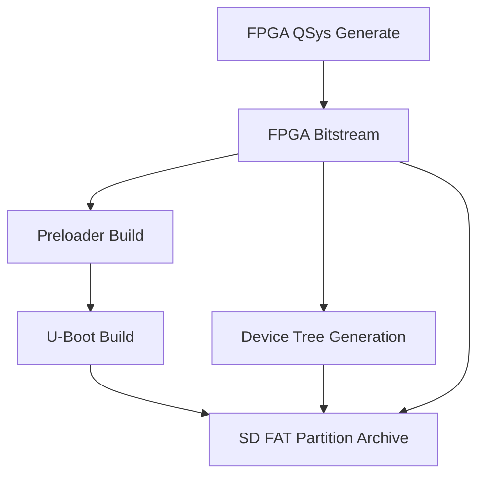
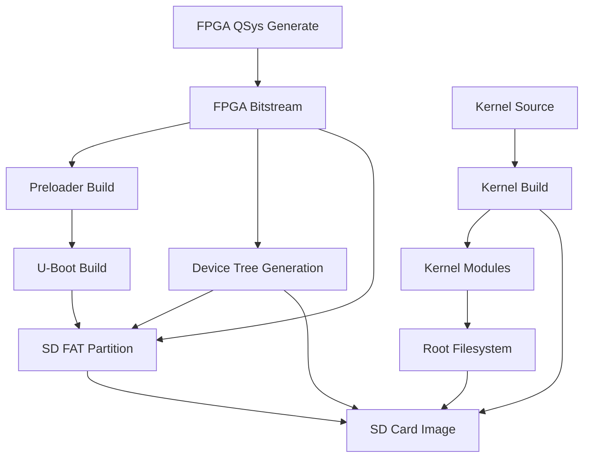

# Linux HPS Image Build Capability Assessment

**Assessment Date:** 2024  
**Repository:** low-latency-market-analysis  
**Target Platform:** DE10-Nano SoC (Cyclone V)

## Executive Summary

The repository currently has **partial automation** for building Linux HPS images. The bootloader components (preloader, U-Boot, device tree) are **fully automated**, but **kernel compilation and root filesystem creation are not automated** - only documented at a high level.

**Overall Completion:** ~40%
- ✅ Bootloader components: Fully automated
- ❌ Kernel: Not automated
- ❌ Rootfs: Not automated
- ❌ Integration: Not automated

---

## 1. Preloader Build Assessment

### Status: ✅ Fully Automated

**Location:** [`FPGA/Makefile`](FPGA/Makefile) lines 1050-1092

### Implementation Details

- **Makefile Target:** `make preloader`
- **Output Directory:** `HPS/preloader/` (created at build time)
- **Output File:** `HPS/preloader/preloader-mkpimage.bin`
- **Dependencies:**
  - SoC EDS tools (`bsp-create-settings`)
  - QSys handoff files: `hps_isw_handoff/$(QSYS_BASE)_$(QSYS_HPS_INST_NAME)/id`
  - Quartus compilation (if `HAVE_QUARTUS=1`)

### Build Process

1. Creates preloader BSP using `bsp-create-settings`:
   ```makefile
   $(SBT.CREATE_SETTINGS) \
       --type spl \
       --bsp-dir $(PRELOADER_DIR) \
       --preloader-settings-dir "hps_isw_handoff/$(QSYS_BASE)_$(QSYS_HPS_INST_NAME)" \
       --settings $(PRELOADER_DIR)/settings.bsp \
       $(PRELOADER_EXTRA_ARGS)
   ```

2. Builds preloader using generated Makefile in BSP directory:
   ```makefile
   $(MAKE) -C $(PRELOADER_DIR)
   ```

### Configuration Options

- **Watchdog:** Disabled by default (`PRELOADER_DISABLE_WATCHDOG=1`)
- **ECC Scrubbing:** Enabled by default (`PRELOADER_ENABLE_ECC_SCRUBBING=1`)

### SoC EDS Detection

The Makefile searches for `bsp-create-settings` in multiple locations:
- PATH
- `$(SOCEDS_DEST_ROOT)/host_tools/bin/`
- `$(SOCEDS_DEST_ROOT)/bin/`
- Recursive search in `$(SOCEDS_DEST_ROOT)`

**Status:** ✅ Robust tool detection with clear error messages if not found.

### Verification

- ✅ Makefile target exists and is functional
- ✅ Dependency management correct
- ✅ Output path correctly configured (`HPS/preloader/`)
- ✅ Integration with `make everything` and `make all` targets
- ✅ Clean target removes preloader directory

---

## 2. U-Boot Build Assessment

### Status: ✅ Fully Automated

**Location:** [`FPGA/Makefile`](FPGA/Makefile) lines 1095-1113

### Implementation Details

- **Makefile Target:** `make uboot`
- **Output File:** `HPS/preloader/uboot-socfpga/u-boot.img`
- **Dependencies:** Preloader build (`PRELOADER_STAMP`)
- **Additional Tool:** `mkimage` (built as part of U-Boot)
  - Location: `HPS/preloader/uboot-socfpga/tools/mkimage`

### Build Process

1. Depends on preloader build completion
2. Builds U-Boot from within preloader directory:
   ```makefile
   $(MAKE) -C $(PRELOADER_DIR) uboot
   ```

### Verification

- ✅ Makefile target exists and is functional
- ✅ Correct dependency on preloader
- ✅ Output path correctly configured
- ✅ `mkimage` tool available for boot script generation
- ✅ Integration with `make everything` and `make all` targets

---

## 3. Device Tree Generation Assessment

### Status: ✅ Fully Automated

**Location:** [`FPGA/Makefile`](FPGA/Makefile) lines 1169-1239

### Implementation Details

- **Makefile Targets:** `make dts` and `make dtb`
- **Input File:** `FPGA/generated/soc_system.sopcinfo` (generated by QSys)
- **Output Files:**
  - DTS: `FPGA/generated/soc_system.dts`
  - DTB: `FPGA/generated/soc_system.dtb`

### Build Process

1. **DTS Generation** (lines 1210-1213):
   - Uses `sopc2dts` tool from SoC EDS
   - Input: `.sopcinfo` file
   - Board info files:
     - `FPGA/quartus/qsys/soc_system_board_info.xml`
     - `FPGA/quartus/qsys/hps_common_board_info.xml`
   - Arguments: `--bridge-removal all --clocks`

2. **DTB Compilation** (lines 1236-1239):
   - Uses `dtc` (Device Tree Compiler)
   - Input: `.dts` file
   - Output: `.dtb` binary

### Board Info Files

**soc_system_board_info.xml:**
- Defines board model: "Terasic DE10 NANO"
- Compatible strings: `altr,socfpga-cyclone5`, `altr,socfpga`

**hps_common_board_info.xml:**
- Common HPS configuration (exists in repository)

### Verification

- ✅ Makefile targets exist and are functional
- ✅ Correct dependency on QSys generation
- ✅ Board info files present
- ✅ Integration with `make everything` and `make all` targets
- ✅ Clean target removes DTS/DTB files

---

## 4. SD Card FAT Partition Assessment

### Status: ✅ Partially Automated

**Location:** [`FPGA/Makefile`](FPGA/Makefile) lines 1247-1273

### Implementation Details

- **Makefile Target:** `make sd-fat`
- **Output File:** `sd_fat.tar.gz`
- **Contents:**
  - `u-boot.scr` (U-Boot boot script)
  - `boot.script` (source for u-boot.scr)
  - `DE10_NANO_SoC_GHRD.rbf` (FPGA bitstream)
  - `soc_system.dtb` (device tree blob)

### Boot Script Generation

**boot.script** (lines 1247-1255):
- Loads FPGA bitstream from SD card
- Configures device tree
- Enables HPS-FPGA bridge
- Boots Linux from SD card

**u-boot.scr** (lines 1261-1262):
- Compiled boot script using `mkimage`
- Created from `boot.script` source

### Limitations

- ⚠️ **Only creates FAT partition archive, not complete SD card image**
- ⚠️ **No partition table creation**
- ⚠️ **No root filesystem integration**
- ⚠️ **No automated SD card flashing**

### Verification

- ✅ Makefile target exists and is functional
- ✅ Correct dependencies (RBF, DTB, boot scripts)
- ✅ Integration with `make everything` and `make all` targets
- ⚠️ Incomplete - only FAT partition, not full image

---

## 5. Linux Kernel Build Assessment

### Status: ❌ Not Automated

**Documentation:** [`documentation/deployment/linux_HPS_image.md`](documentation/deployment/linux_HPS_image.md) lines 23-34

### What Exists

**Documentation Only:**
- High-level description of kernel build process
- Mentions: clone kernel, apply patches, configure, build
- Example commands provided but not integrated

**Integration Script:**
- [`HPS/integration/integrate_linux_driver.sh`](HPS/integration/integrate_linux_driver.sh)
  - Integrates calculator driver into existing kernel
  - Supports kernel module integration
  - **Requires:** Pre-existing kernel source directory

### What's Missing

1. **No Makefile Targets:**
   - No `make kernel` target
   - No `make kernel-config` target
   - No `make kernel-modules` target

2. **No Kernel Source Management:**
   - No automated kernel source cloning/checkout
   - No kernel version specification
   - No patch management system

3. **No Kernel Configuration:**
   - No default kernel config file (`.config`)
   - No kernel config templates
   - No automated config generation

4. **No Build Integration:**
   - Kernel build not integrated with main build system
   - No dependency management (kernel → rootfs)
   - No version compatibility checking

5. **No Output Management:**
   - No standardized kernel output location
   - No zImage/DTB output integration with SD card image

### Required Manual Steps (from documentation)

```bash
# Clone Linux kernel source
git clone <kernel-repo>

# Apply DE10-Nano specific patches
# (patches not provided in repository)

# Configure kernel
make ARCH=arm socfpga_defconfig
make ARCH=arm menuconfig  # Optional

# Build kernel and modules
make ARCH=arm CROSS_COMPILE=arm-linux-gnueabihf- zImage dtbs modules -j$(nproc)
```

### Recommendations

1. Create `HPS/kernel/` directory structure
2. Add Makefile with kernel build targets
3. Implement kernel source management (git submodule or download script)
4. Add kernel configuration templates
5. Integrate with existing build system

---

## 6. Root Filesystem Build Assessment

### Status: ❌ Not Automated

**Documentation:** [`documentation/deployment/linux_HPS_image.md`](documentation/deployment/linux_HPS_image.md) lines 36-40

### What Exists

**Documentation Only:**
- Mentions "debootstrap" without details
- Lists high-level steps: setup Debian, add packages, configure network, setup services
- No implementation details

### What's Missing

1. **No Build Scripts:**
   - No debootstrap scripts
   - No rootfs creation automation
   - No package list management

2. **No Configuration Management:**
   - No network configuration templates
   - No service setup scripts
   - No user account configuration

3. **No Integration:**
   - Rootfs build not integrated with main build system
   - No dependency management (kernel modules → rootfs)
   - No SD card image integration

4. **No Tool Verification:**
   - No check for `debootstrap`
   - No check for `qemu-user-static` (required for ARM chroot)
   - No root access verification

### Required Manual Steps (from documentation)

```bash
# Set up Debian base system using debootstrap
# (no specific commands provided)

# Add required packages and configurations
# (no package list provided)

# Configure network interfaces
# (no configuration files provided)

# Set up custom services
# (no service files provided)
```

### Recommendations

1. Create `HPS/rootfs/` directory structure
2. Add debootstrap scripts with package lists
3. Create configuration file templates
4. Add rootfs image creation automation
5. Integrate with existing build system

---

## 7. End-to-End Workflow Assessment

### Status: ❌ Not Integrated

### Current Workflow (What Works)



### Missing Workflow (What's Needed)



### Integration Gaps

1. **No Unified Build Command:**
   - `make everything` only builds bootloader components
   - No single command to build complete image

2. **No Dependency Management:**
   - Kernel and rootfs builds not integrated
   - No version compatibility checking
   - No build order enforcement

3. **No SD Card Image Creation:**
   - Only FAT partition archive exists
   - No complete bootable image creation
   - No partition table creation
   - No rootfs integration

4. **No Validation:**
   - No build verification
   - No image testing
   - No automated SD card flashing

### Recommendations

1. Create unified build script/Makefile
2. Integrate all components into single workflow
3. Add SD card image creation
4. Add validation and testing
5. Add automated SD card flashing option

---

## 8. Dependencies and Prerequisites

### Currently Required (for existing automation)

1. **Intel SoC EDS**
   - **Purpose:** Preloader, U-Boot, device tree generation
   - **Tools:** `bsp-create-settings`, `sopc2dts`, `dtc`
   - **Detection:** ✅ Automated in Makefile
   - **Installation:** ❌ Not automated (user must install)

2. **Intel Quartus Prime**
   - **Purpose:** FPGA bitstream generation
   - **Detection:** ✅ Automated in Makefile
   - **Installation:** ❌ Not automated (user must install)

3. **Cross-Compilation Toolchain**
   - **Default:** `arm-linux-gnueabihf-`
   - **Detection:** ❌ Not verified (assumed installed)
   - **Installation:** ❌ Not automated

### Missing Prerequisites (for full image build)

1. **Linux Kernel Source**
   - **Status:** ❌ Not managed
   - **Required:** Git repository URL, version/tag specification

2. **Rootfs Build Tools**
   - **debootstrap:** ❌ Not checked
   - **qemu-user-static:** ❌ Not checked
   - **Root access:** ❌ Not verified

3. **SD Card Tools**
   - **parted/fdisk:** ❌ Not checked
   - **mkfs.ext4:** ❌ Not checked
   - **dd:** ❌ Not checked

---

## 9. Documentation Assessment

### Existing Documentation

1. **`documentation/deployment/linux_HPS_image.md`**
   - **Content:** High-level overview of two approaches (Debian, Yocto)
   - **Quality:** Basic, lacks detail
   - **Completeness:** ~30% - mentions steps but no commands/details
   - **Actionability:** Low - requires significant research to implement

2. **`documentation/reference/Building-Embedded-Linux.md`**
   - **Content:** Conceptual overview only
   - **Quality:** Very basic
   - **Completeness:** ~10% - just explains what components are needed

3. **`FPGA/README.md` and `HPS/README.md`**
   - **Content:** Focus on using prebuilt images
   - **Quality:** Good for prebuilt workflow
   - **Completeness:** Doesn't cover building from scratch

### Missing Documentation

1. **Step-by-step kernel build guide**
2. **Rootfs creation detailed instructions**
3. **Complete SD card image creation process**
4. **Troubleshooting guide for build failures**
5. **Version compatibility matrix**
6. **Toolchain setup instructions**

---

## 10. Recommendations

### Priority 1: Kernel Build Automation

**Create:** `HPS/kernel/` directory structure

**Add:**
- Makefile targets for kernel build
- Kernel source management (git clone/checkout)
- Kernel configuration management
- Integration with existing build system

**Files to Create:**
- `HPS/kernel/Makefile`
- `HPS/kernel/configs/socfpga_defconfig` (or reference)
- `HPS/kernel/patches/` (for DE10-Nano patches)
- `HPS/kernel/README.md`

### Priority 2: Rootfs Build Automation

**Create:** `HPS/rootfs/` directory structure

**Add:**
- Debootstrap scripts
- Package list management
- Configuration file templates
- Rootfs image creation

**Files to Create:**
- `HPS/rootfs/build_rootfs.sh`
- `HPS/rootfs/packages.txt`
- `HPS/rootfs/configs/` (network, services, etc.)
- `HPS/rootfs/Makefile`

### Priority 3: Complete Image Integration

**Create:** Unified build system

**Add:**
- Single command to build complete image
- SD card image creation
- Validation and testing
- Automated SD card flashing

**Files to Create:**
- `HPS/build_image.sh` or `HPS/Makefile` (extend existing)
- `HPS/create_sd_image.sh`
- `HPS/validate_image.sh`

### Priority 4: Documentation Enhancement

**Expand:**
- `documentation/deployment/linux_HPS_image.md` with detailed steps
- Add troubleshooting sections
- Create quick reference guides
- Document version requirements

---

## 11. Conclusion

**Current State:** ~40% complete
- ✅ Bootloader components: Fully automated
- ❌ Kernel: Not automated
- ❌ Rootfs: Not automated
- ❌ Integration: Not automated

**To Build Complete Image from Scratch:** Requires significant additional work to automate kernel and rootfs builds, plus integration scripts.

**Estimated Effort:**
- Kernel build automation: 2-3 days
- Rootfs build automation: 2-3 days
- Integration and testing: 1-2 days
- Documentation: 1 day
- **Total:** ~1-2 weeks of development work

---

## Appendix: File References

### Automated Components

- **Preloader:** [`FPGA/Makefile`](FPGA/Makefile) lines 1050-1092
- **U-Boot:** [`FPGA/Makefile`](FPGA/Makefile) lines 1095-1113
- **Device Tree:** [`FPGA/Makefile`](FPGA/Makefile) lines 1169-1239
- **SD FAT Partition:** [`FPGA/Makefile`](FPGA/Makefile) lines 1247-1273

### Documentation

- **Linux HPS Images:** [`documentation/deployment/linux_HPS_image.md`](documentation/deployment/linux_HPS_image.md)
- **Building Embedded Linux:** [`documentation/reference/Building-Embedded-Linux.md`](documentation/reference/Building-Embedded-Linux.md)

### Integration Scripts

- **Driver Integration:** [`HPS/integration/integrate_linux_driver.sh`](HPS/integration/integrate_linux_driver.sh)

### Board Configuration

- **Board Info:** [`FPGA/quartus/qsys/soc_system_board_info.xml`](FPGA/quartus/qsys/soc_system_board_info.xml)
- **HPS Common:** [`FPGA/quartus/qsys/hps_common_board_info.xml`](FPGA/quartus/qsys/hps_common_board_info.xml)
